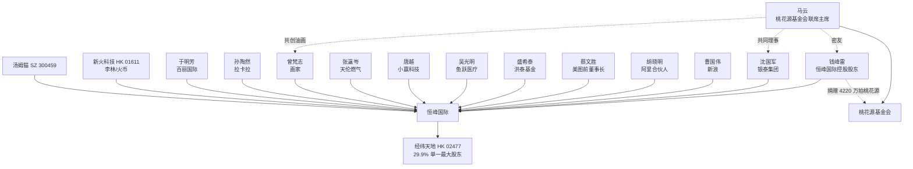

# 钱峰雷（"钱多多"）人物档案与资本运作手法图谱

> **免责声明**：本文基于公开媒体报道、公司公告与裁判文书整理，不对钱峰雷个人做任何法律定性；所有推断仅代表分析视角，不构成投资建议。
>
> **数据截止日期**：2026-07-05
>
> **档案结构**：每个条目采用【事实】/【推断】/【信号】三层结构——【事实】为公开记录的硬信息；【推断】为基于事实的合理推断；【信号】为对投资者的可操作识别信号。

## 目录

1. [出身与早期财富积累](#一出身与早期财富积累)
2. [名流关系网络](#二名流关系网络)
3. [商业版图与持股结构](#三商业版图与持股结构)
4. [恒峰国际股东网络](#四恒峰国际股东网络)
5. [过往争议与风险事件](#五过往争议与风险事件)
6. [资本市场操作历史](#六资本市场操作历史)
7. [公开行为风格信号](#七公开行为风格信号)
8. [复合识别信号总表](#八复合识别信号总表)
9. [引用源](#引用源)
10. [相关报告双链](#相关报告双链)

---

## 一、出身与早期财富积累

### 1.1 基本信息

- **【事实】** 钱峰雷，男，1976 年 11 月出生，浙江宁波鄞州横街人，现年 49 岁。
- **【事实】** 自述幼年家境普通，初中时被学校劝退，靠卖田螺开启做生意之路。
- **【事实】** 2000 年左右开始创业，先后涉足广告装饰、投资咨询等业务，曾获宁波市室内装饰行业项目经理证书，但装饰公司生意失败。
- **【事实】** 此后五六年间（约 2000-2006 年），财富迅速积累，但发家路径一直成谜。
- **【推断】** 2000-2006 年的财富跃升期与公开记录中的赌场业务时间高度重合。
- **【信号】** 操盘人原始财富来源不透明，意味着其资本市场操作的"底色"难以验证——投资者无法判断其真实资金成本、杠杆水平与退出动机。

### 1.2 澳门"叠码仔"传闻

- **【事实】** 外界流传最广的版本是——钱峰雷在澳门当"叠码仔"（替赌场寻找赌客客源、鼓励赌客博彩、从中获取佣金），掘到了人生第一桶金。
- **【事实】** 据媒体报道与公开裁判文书，钱峰雷曾被指在澳门从事叠码业务，承包赌厅；宁波法院文件显示其涉赌场案件，持股 40%，涉案超 4000 万元。
- **【事实】** "叠码仔"的工作可类比"赌场券商"——根据赌客信用额度提供融资融券服务，从每笔交易中抽佣。
- **【推断】** 叠码仔出身意味着钱峰雷深谙"杠杆+筹码派发+套现"思维，这套思维可能被平移到资本市场操作。
- **【信号】** 操盘人具备赌场背景，意味着其资本市场操作可能沿用"筹码派发+杠杆+套现"思维——这是识别其操盘手法的核心锚点。

---

## 二、名流关系网络

### 2.1 与马云的关系

- **【事实】** 钱峰雷与马云关系密切，被媒体长期冠以"马云密友"之称。具体公开记录包括：
  - 2014 年 9 月阿里巴巴美股上市敲钟时，钱峰雷站在马云身边，陪同在纳斯达克。
  - 2016、2017 年双十一晚会，钱峰雷在场。
  - 2018 年 11 月 12 日，钱峰雷晒出与马云的合照。
  - 2018 年 11 月，钱峰雷收到马云和虞锋的生日祝福——"恭贺钱多多同学生日快乐"。
  - 钱峰雷与甲骨文 CEO 拉里·埃里森、巴菲特把酒言欢时，马云都在场。
  - 马云是大自然保护协会（TNC）中国主席，钱峰雷是 TNC 理事。
  - 钱峰雷位于香港山顶白加道 28 号的别墅，距离马云在香港的住所不远。2014 年 1 月，他花 6.9 亿港元买下这栋豪宅。
- **【推断】** 钱峰雷的"马云密友"标签是其资本市场操作的重要信用背书——合作方/对手盘会因"马云圈子"而给予信任溢价。
- **【信号】** 当操盘人主动展示与顶级企业家的合影、私交，但其个人商业履历与该企业家无产业协同时，应警惕——这种"名流背书"是吸引散户跟风的工具，而非真实价值锚。

### 2.2 蚂蚁集团股东身份

- **【事实】** 钱峰雷与父亲钱友定通过云锋基金持有蚂蚁集团不少份额。
- **【事实】** 天眼查数据显示，钱峰雷是蚂蚁集团上海系股东——上海经颐投资中心（有限合伙），截至 2019-10-12 持股 4.88%。
- **【推断】** 蚂蚁集团股东身份是钱峰雷"大佬"人设的核心资产。但据自媒体分析，蚂蚁股东身份可能并非纯粹自有资金——叠码仔常作为大金主"代客理财"的通道。
- **【信号】** 操盘人持有知名未上市公司股权，但资金来源不透明，可能是"通道"而非真实投资者——其公开声称的"百亿身家"需打折。

### 2.3 桃花源基金会

- **【事实】** 2015 年，钱峰雷以 4220 万港元拍下马云与画家曾梵志共创的油画《桃花源》（起拍价 130 万港币，溢价 32 倍）。所得款项捐赠给桃花源基金会。
- **【事实】** 桃花源基金会 2015 年成立，由马云、马化腾出任董事会联席主席，理事包括沈国军、欧亚平、朱保国、曾梵志、王中军、虞峰、吴鹰、唐越、宋立新、张爽。
- **【推断】** 钱峰雷通过桃花源基金会与马云、马化腾、沈国军等大佬建立深度连接——这成为其后续恒峰国际"全明星股东阵容"的人脉基础。
- **【信号】** 操盘人通过慈善拍卖进入顶级企业家圈子，是其积累"信用资本"的典型路径——投资者应区分"慈善信用"与"投资能力"。

---

## 三、商业版图与持股结构

### 3.1 环球国际控股

- **【事实】** 钱峰雷任环球国际（香港）控股集团有限公司董事长。
- **【事实】** 钱峰雷是浙江第一架私人飞机拥有者，命名为"环球号"。
- **【事实】** 传闻以 120 万元拍下"浙 A88888"车牌。
- **【推断】** "环球国际"是钱峰雷早期的主要资本运作平台，但其公开业绩记录稀薄。

### 3.2 恒峰国际

- **【事实】** 恒峰国际（含 BVI 恒峰国际控股 + 浙江恒峰国际控股）成立于 2017 年 5 月，注册资本 10 亿元，总部杭州。
- **【事实】** 公司由钱峰雷个人注资 5000 万美元创立，并完成 1 亿美元首轮融资。
- **【事实】** 公司主营业务：股权投资及并购，投资领域涵盖医疗健康、高端制造、能源环保、文化教育；2025 年起转向 Web3 业务（Fochat、Fopay、资产管理）。
- **【事实】** 据企查查，钱峰雷旗下拥有近 20 家企业，合作伙伴包括云锋基金、蚂蚁集团、环球国际、星辰投资贸易、埃摩森猎头机构等。
- **【事实】** 钱峰雷主要投资项目包括：蚂蚁金服、快手、阿里健康、TNC。
- **【推断】** 恒峰国际的投资组合看似豪华，但缺乏可验证的退出记录——所谓"投资项目"可能只是跟投而非主导。
- **【信号】** 操盘人旗下企业众多但缺乏可验证业绩，应警惕"版图幻觉"——投资范围越宽，越说明缺乏真正的核心竞争力。

---

## 四、恒峰国际股东网络

### 4.1 全明星股东阵容

经纬天地 2025-01-06 公告披露，恒峰国际的股东除钱峰雷本人外，还包括：

| 股东 | 身份 | 所在产业 |
|---|---|---|
| 沈国军 | 银泰集团创始人及董事长 | 商业地产/零售 |
| 曹国伟 | 新浪集团董事长及 CEO | 互联网/媒体 |
| 胡晓明 | 阿里巴巴合伙人、前蚂蚁金服行政总裁 | 互联网金融 |
| 蔡文胜 | 美图公司前董事长及执行董事 | 互联网/区块链 |
| 盛希泰 | 洪泰基金创始人 | 风险投资 |
| 吴光明 | 鱼跃医疗创始人 | 医疗器械 |
| 唐越 | 小赢科技创始人 | 互联网金融 |
| 张瀛岑 | 天伦燃气控股董事长 | 城市燃气 |
| 曾梵志 | 著名画家 | 艺术品 |
| 孙陶然 | 拉卡拉创始人 | 支付 |
| 于明芳 | 百丽国际联合创始人 | 鞋业/零售 |
| 新火科技控股（HK 01611） | 实控人李林（火币创始人） | 加密货币交易所 |
| 汤姆猫（SZ 300459） | 上市公司 | 游戏/互联网 |

### 4.2 股东网络关系图

### 4.3 网络分析

- **【事实】** 13+ 个股东涵盖互联网、金融、医疗、能源、艺术品、加密货币等不同产业，且无显著业务协同。
- **【推断】** 这种"全明星 + 无产业协同"的股东结构，更像是"朋友圈拼盘"而非战略投资——每位明星股东投入金额可能不大（50 人合计 1 亿美元首轮融资，人均约 200 万美元），但带来的"信用溢价"巨大。
- **【信号】** 当一家私募的股东名单"全明星"但无产业协同时，应警惕——这是"信用拼盘"而非战略资本，目的是让被投公司（如经纬天地）能借股东名气吸引散户跟风。

---

## 五、过往争议与风险事件

### 5.1 2014 年林圣雄持枪事件

- **【事实】** 2014 年，钱峰雷结识温州富豪林圣雄。林的浙江圣雄集团、新疆圣雄能源等陷入经营困境，林圣雄想去新加坡赌场博一博。两人联手，不到 10 天就赚了 2 亿。
- **【事实】** 2014 年 10 月，林圣雄以结算金额少于"码单"记录金额为由，向外界散布钱峰雷"偷码"的消息。钱峰雷要求与林圣雄同去查看赌博时的监控录像，被林拒绝。
- **【事实】** 2014 年 11 月 14 日，钱峰雷为化解矛盾，与助理前往温州。林圣雄为让他承认"偷码"并赔偿损失，挖好了坑——两人未谈拢发生争执，林圣雄把枪对准了钱峰雷。
- **【事实】** 为求生，钱峰雷补偿损失 **6.5 亿元人民币**。6.5 亿对于刚斥巨资买豪宅的钱峰雷而言也是不小的数目，于是他将仅购买一年的白加道豪宅抵押贷款。
- **【推断】** 6.5 亿"保命钱"说明钱峰雷的资金链高度依赖高杠杆——抵押豪宅才能拿出 6.5 亿，意味着其现金头寸远低于外界想象的"百亿身家"。
- **【信号】** 操盘人有"被胁迫支付大额和解金"的记录，意味着其资金链可能高度杠杆化，且面临非市场化的资金压力——这类操盘人在资本市场操作时，退出动机比一般投资者更迫切。

### 5.2 2020 年香港湾仔被砍事件

- **【事实】** 2020-11-14 凌晨，钱峰雷与一名方姓男子离开湾仔会展皇朝会时，遭三名男子持刀追斩。凶手见得手后火速逃离。
- **【事实】** 方姓男子被送律敦治医院时头部需包扎，脸与双手沾有血渍；钱峰雷由司机陪同送院，2 人接受初步治疗后转送东区医院。
- **【事实】** 2020-11-15，钱峰雷接受港媒访问称"不知道对方是谁，没有与人发生冲突"。
- **【事实】** 当晚，钱峰雷发微博感谢香港警队，并悬赏 **港币 1000 万元**缉凶——任何人士若能提供可靠消息或证据可获奖赏。
- **【事实】** 行凶者目标明确——只砍人，不劫财。
- **【推断】** 行凶者目标明确、不劫财，意味着这是"报复性"或"灭口性"袭击，与钱峰雷的资金往来纠纷高度相关。蚂蚁 IPO 折戟（2020-11-03）后 11 天即发生袭击，时间点敏感——可能是赌场/资金通道业务出现兑付危机，债主追讨。
- **【信号】** 操盘人有被袭击记录且悬赏缉凶，意味着其卷入深度的资金/江湖纠纷——这类操盘人在资本市场操作时，"急着套现还债"的动机可能压倒"长期经营"的动机。

### 5.3 2025 年涉嫌销售未经认可投资计划

- **【事实】** 2025-07-23，财新报道称，钱峰雷与旗下实控的恒峰国际等多家公司，涉嫌在香港向公众销售多项未经香港证监会认可的集体投资计划，上万人已遭受财务损失，部分人士在内地公安机关报案。
- **【事实】** 涉嫌违规的产品包括：
  - "桃花源 NFT"——钱峰雷 2015 年拍下的油画《桃花源》的 NFT 化，EPIC 传奇版 888 份售价 1.5 万 USDT/份，普通版 8000 份售价 1000-1500 USDT/份
  - "加密币 Fo Coin"
  - "基金理财产品多多一号、多多二号"
- **【事实】** 恒峰国际回应称财新报道"严重失实"，"桃花源 NFT、加密币 Fo Coin、基金理财产品多多一号、多多二号"均非恒峰国际及恒峰科技发行的产品，将启动维权程序。
- **【推断】** 财新作为内地权威财经媒体，报道经过严格审核。即使部分产品非恒峰国际直接发行，钱峰雷作为"钱多多"IP 的核心，其个人/关联公司销售未经认可投资计划的指控具备较高可信度。
- **【信号】** 操盘人面临"涉嫌违规销售"指控 + 内地公安机关报案记录，意味着其资金链可能依赖"高息募集资金"维持——这类操盘人在资本市场操作时，可能有"用股价上涨掩盖兑付压力"的动机。

### 5.4 风险事件时间线

| 时间 | 事件 | 金额 | 性质 |
|---|---|---|---|
| 2014-11-14 | 林圣雄持枪事件，被迫和解 | 6.5 亿元人民币 | 赌场纠纷 |
| 2020-11-14 | 香港湾仔被砍事件 | 悬赏 1000 万港币 | 报复性袭击 |
| 2025-07-23 | 财新爆料涉嫌违规销售 | 上万人受损 | 金融违规 |
| 2025-01 至 2026-05 | 经纬天地操盘 | 10.5 亿港元控股 | 资本市场操作 |

---

## 六、资本市场操作历史

### 6.1 经纬天地操盘（2025-01 至今）

详见 [[jingwei-tiandi-02477]]。核心数据：

- 2025-01 至 2025-04：通过恒峰国际分两笔协议收购 29.9% 股权，总耗资 10.5 亿港元，均价 5.26 港元/股。
- 2025-05 至 2026-05：发布 Fopay 稳定币、AI 算力、Token API 等多重概念，配合入通催化。
- 2026-05-21：单日暴跌 83.16%，主力完成派发。

### 6.2 "FO-X"Web3 战略

- **【事实】** 2025-05-09，恒峰国际宣布启动"FO-X"Web3 战略，孵化三大业务：
  - Fochat——社交驱动的去中心化交易平台，定位"10 亿用户进入 Web3 的核心入口"，已积累百万级用户
  - 资产管理——恒峰国际旗下设立资产管理持牌子公司，构建"资产管理+专业咨询"双引擎
  - Fopay——跨境支付平台，定位"币圈支付宝"，7×24 小时跨境结算
- **【事实】** 2025-07-21，经纬天地公告推出 Fopay 稳定币支付平台。
- **【推断】** "FO-X"战略的核心是把经纬天地作为 Web3 业务的"上市壳"——通过上市公司公告释放概念，拉动股价，再通过 NFT、加密币等非上市产品向 FoChat 群内 2 万+ 粉丝募集资金。
- **【信号】** 当操盘人同时拥有"上市公司概念公告"与"非上市投资产品销售"两条业务线时，应警惕——这两条业务线可能形成"上市公司拉股价 + 非上市产品圈钱"的闭环，且后者缺乏监管。

### 6.3 其他资本运作

- **【事实】** 钱峰雷通过云锋基金持有蚂蚁集团份额（前已述）。
- **【事实】** 据恒峰国际官网，钱峰雷主要投资项目包括蚂蚁金服、快手、阿里健康、TNC。
- **【推断】** 这些投资均为跟投而非主导，且多数为"马云圈子"项目——钱峰雷的"投资能力"高度依赖其人脉网络，而非独立判断。
- **【信号】** 操盘人投资记录以"大佬跟投"为主，无独立成功案例，应警惕其"独立操盘"能力——经纬天地是其首次独立操盘的港股案例，结果即暴跌 83%。

---

## 七、公开行为风格信号

### 7.1 慈善拍卖阔绰

| 时间 | 拍品 | 金额 | 备注 |
|---|---|---|---|
| 2006 | 嫣然天使基金拍品 | 500 万 | 一举赢得大量关注 |
| 2012-05-27 | 新疆和田玉玉观音 | 2000 万 | "钱多多"绰号由此而来 |
| 2013-05 | 油画《望月》 | 3000 万港币 | 比底价高 10 倍 |
| 2015 | 马云油画《桃花源》 | 4220 万港币 | 起拍 130 万港币，溢价 32 倍 |

### 7.2 高调炫富

- **【事实】** 2013-07，宁波鄞州茅山中学 92 届同学会，钱峰雷给班上每位同学送 iPhone 5；2014-10 又送 iPhone 6 给全年级。
- **【事实】** 2014-01，6.9 亿港元买入香港白加道 28 号 7 号屋（据资料需付高达 1.6 亿元税项，创辣招后新高）。
- **【事实】** 浙江第一架私人飞机"环球号"。
- **【事实】** 浙 A88888 车牌（传闻 120 万拍下）。
- **【事实】** 亲戚婚礼送兰博基尼 + 200 多位亲友每人 1 万元红包。
- **【事实】** 2025 年高调回归公众视野：入驻抖音、视频号，开直播，与百万粉丝博主共创视频展示豪宅（电梯厅马云写的"福"字、《桃花源》油画、邻居"马校长"的房子）。

### 7.3 行为风格分析

- **【推断】** 叠码仔的标准包装就是"高调炫富"——飞机、豪车、豪宅、慈善拍卖，都是为了建立"成功人士"人设，吸引大客户。这与传统企业家"闷声发大财"的风格截然不同。
- **【推断】** 钱峰雷的炫富节奏（2013-2015 年密集慈善+买豪宅，2025 年抖音高调回归）与两次资本市场操作（2014 年阿里 IPO 前后、2025 年入主经纬天地）时间点高度重合——炫富是"信用建设"投入，资本市场操作是"信用变现"。
- **【信号】** 操盘人高调炫富 + 慈善拍卖阔绰 + 短视频平台 IP 化运营，应警惕——这是"叠码仔式"信用建设，目的是为后续资本运作吸引跟风资金。

---

## 八、复合识别信号总表

当操盘人具备以下特征时，应提高警觉。每条信号可独立判断，**符合 ≥3 条即应一票否决**。

| # | 信号 | 钱峰雷案例 | 通用识别要点 |
|---|---|---|---|
| 1 | 操盘人具备赌场/叠码仔背景 | 澳门叠码传闻 + 法院文件 | 操盘人公开履历中是否有赌场、博彩、地下钱庄背景 |
| 2 | 操盘人通过新设 SPV 入主而非二级市场买入 | 恒峰国际 2025-01 入主 | 收购主体是否为近 1-3 年新设的 BVI/离岸公司 |
| 3 | 操盘人股东名单"全明星"但无产业协同 | 13+ 个跨行业明星股东 | 股东名单是否跨行业、无业务协同、人均出资额小 |
| 4 | 操盘人过往有被砍/涉案/和解记录 | 2014 持枪事件 + 2020 被砍 + 2025 涉嫌违规销售 | 公开报道中是否有暴力纠纷、大额和解、监管处罚 |
| 5 | 操盘人通过拆股+入通组合完成派发 | 4-21 拆股 + 5-06 入通 + 5-21 暴跌 | 是否在入通前后 30 天内拆股、发概念公告 |
| 6 | 操盘人在暴跌前发跨界概念公告 | 5-15 AI 算力公告（暴跌前 6 天） | 是否在股价高位突然宣布跨界 AI/算力/稳定币等热门概念 |
| 7 | 操盘人同时销售非上市投资产品 | 桃花源 NFT + Fo Coin + 多多基金 | 是否通过粉丝群、直播、私域向公众销售 NFT/虚拟币/理财产品 |
| 8 | 操盘人高调炫富 + IP 化运营 | 私人飞机 + 浙A88888 + 抖音 IP | 是否通过短视频平台展示豪宅/豪车/名人合影建立个人 IP |
| 9 | 操盘人资金链高杠杆信号 | 6.5 亿抵押豪宅 + 募资用途变更 | 是否有抵押核心资产、变更募资用途、延迟披露兑付危机 |
| 10 | 操盘人无独立成功投资案例 | 蚂蚁/快手/阿里健康均为跟投 | 公开投资记录是否均为"大佬跟投"无独立主导案例 |

**钱峰雷案例评分**：10/10 全中。

---

## 九、人名消歧标签

> 本节用于在金融新闻中识别"钱峰雷"的具体指代。钱峰雷（"钱多多"）在港股/Web3 语境中高度独特，**基本不存在同名歧义**——以下标签主要用于确认身份和排除偶然的同名干扰。

### L1 锚定标签

| # | 标签 | 来源 | 有效期 |
|---|------|------|--------|
| 1 | "钱多多" | 慈善拍卖绰号，媒体广泛使用 | 2012–至今 |
| 2 | 恒峰国际控股创始人/实际控制人 | 港交所公告、工商登记 | 2020s–至今 |
| 3 | 经纬天地（HK 02477）控股股东（2025 年入主） | 港交所权益披露 | 2025-01–至今 |
| 4 | 马云密友 / 蚂蚁集团股东 | 媒体报道、天眼查 | 2014–至今 |

### L2 强组合标签

| # | 组合标签 | 说明 |
|---|----------|------|
| 1 | `[`港股 + 入通即崩 + 叠码仔背景`]` | 同时具备这三条的港股操盘手极少 |
| 2 | `[`慈善拍卖阔绰 + 私人飞机 + 短视频 IP`]` | 钱峰雷式"信用建设"三件套 |
| 3 | `[`浙A88888 + 香港白加道 28 号 + 6.9 亿豪宅`]` | 标志性资产组合 |

### L4 排除标签

| # | 标签 | 排除原因 |
|---|------|----------|
| 1 | 钱峰雷（非金融/非 Web3 语境，如学术/政务/文娱） | 钱峰雷公开身份唯一关联商业/投资——非商业语境中的同名人物是另一个人 |

### L5 领域标签

| 领域 | 方向 |
|------|------|
| 港股/Web3/灰色资本运作 | → 确定就是本文档的钱峰雷 |
| 其他领域 | → 可能为同名不同人，需核实 |

---

## 引用源

1. ["馬雲密友"旗下港股閃崩83%！曾遭仇家追砍，懸賞千萬緝兇 - 鉅亨號](https://hao.cnyes.com/post/248752)
2. [马云好友、蚂蚁股东被砍伤，揭亿万富豪隐秘往事 - 澎湃新闻/投资家](https://m.thepaper.cn/baijiahao_10018993)
3. [千万悬赏，谁砍了马云的挚友？ - xitalk](https://wwyy.org/archives/1726.html)
4. [马云密友『钱多多』被追杀：最新视频曝光，最鲜猛料抖出 - 知乎](https://zhuanlan.zhihu.com/p/297966257)
5. [4亿入股经纬天地，"浙商大佬"钱峰雷背后股东"露真容"！ - 野马财经/新浪财经](https://finance.sina.com.cn/jjxw/2025-01-08/doc-ineehmtt7105754.shtml)
6. [恆峰國際控股經緯天地29.9%，錢峰雷「FO-X」戰略浮出水面 - PR Newswire](https://www.prnewswire.com/apac/zh/news-releases/29-9fo-x-302451014.html)
7. [浙江富商入局稳定币，与马云是密友 - 21经济网](https://www.21jingji.com/article/20250723/herald/6cd8632090983de8b35e7219f3d1dde9.html)
8. [钱峰雷 - 百度百科](https://baike.baidu.com/item/%E9%92%B1%E5%B3%B0%E9%9B%B7/6637455)
9. [经纬天地暴跌，钱峰雷喊话"不跑"，神秘"隐身"股东还在吗？ - 野马财经](https://www.yemacaijing.com/index/view/id/93314.html)
10. [一天闪崩83%！马云密友"钱多多"，深陷"杀猪盘"质疑 - 腾讯新闻](https://news.qq.com/rain/a/20260529A00GUJ00)
11. [钱峰雷发家史 - 雪球](https://xueqiu.com/1020938303/163551467)

## 相关报告双链

- [[person-disambiguation-system]] — 人名消歧方法论框架
- [[jingwei-tiandi-02477]] — 经纬天地案例复盘
- [[hk-stock-ru-tong-ji-beng]] — 港股"入通即崩"操纵模式归纳
- [[hk-stock-red-flag-checklist]] — 港股避坑 8 维度检查清单
- [[retailer-trading-psychology]] — 散户交易心理与纪律
